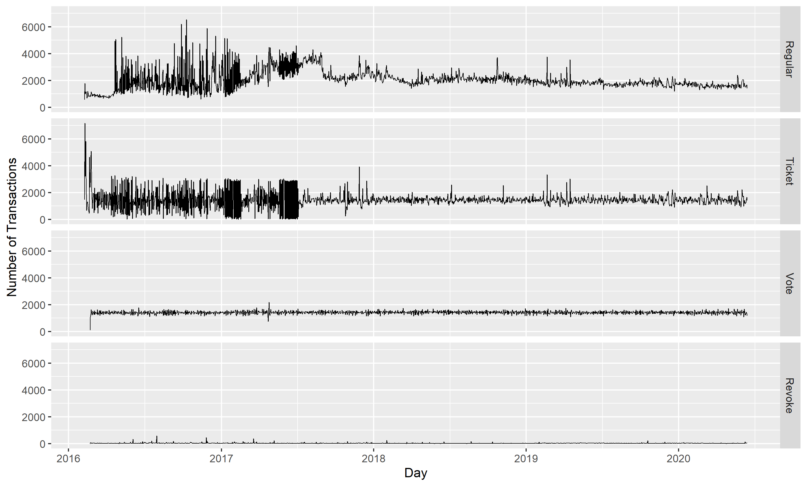
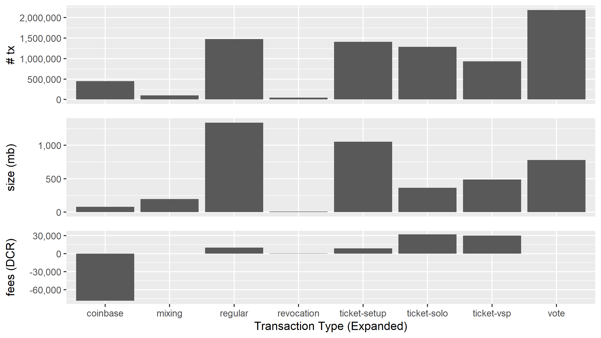
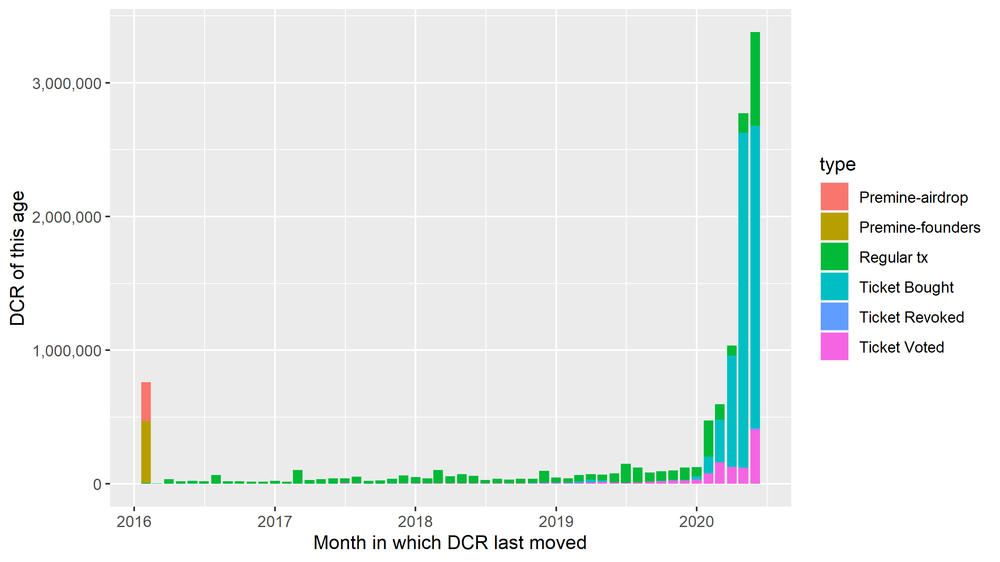
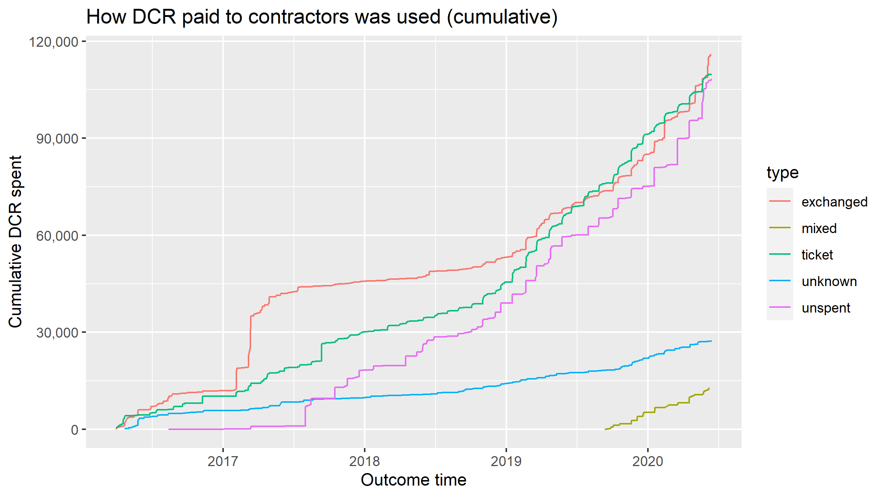
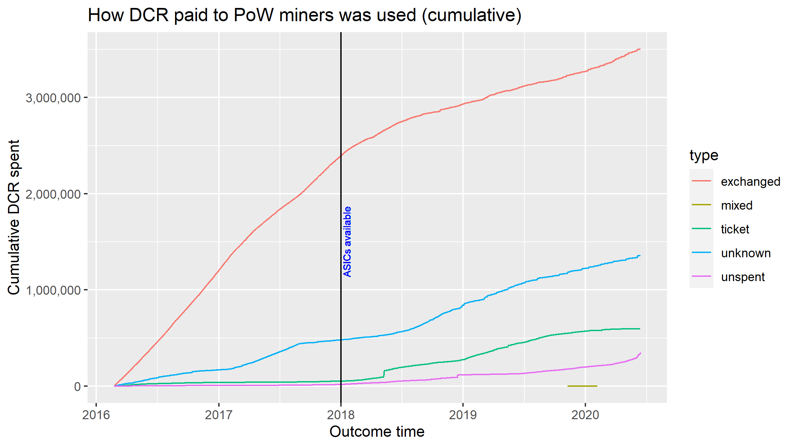

Decred is a UTXO-based blockchain like Bitcoin, but consensus also has a PoS component whereby Decred holders time-lock their credits in exchange for tickets which confer voting rights. A majority of the transactions on the Decred network relate to PoS in various ways. Using data for block 458,101 (Jun 13 2020), 41.5% of transactions are regular, 29.5% are ticket buys, and 28.3% are votes - with 0.06% of transactions related to revoking tickets that failed to vote (missed or expired). 

Each transaction type has a different on chain footprint, and within the set of regular transactions there are a number of sub-types that can be easily identified.1.4 million transactions (43% of all the regular transactions) are engaged in setting up ticket buying transactions. Within the ticket-buying transactions we can differentiate between these which have a single voting address and those with more than 1 (as required for ticket buying with Voting Service Providers that maintain online voting wallets for a small fee). Ticket transactions are relatively small in size, but have accounted for most of the fees paid to PoW miners. This is due largely to a period early in Decred's history when ticket price volatility drove competition to have ticket-buying transactions included in blocks with cheap tickets.

Looking at when the 11.6 million DCR in circulation last moved, again voting plays a big part in accounting for what we see. The ~50% of DCR that participates in PoS is on the move, buying tickets. 8.4 million DCR has moved in 2020, that's 72% of the circulating supply. The other point of interest here is the premine of 1.68 million DCR, of which 762k remains unspent. 465K of the Founders pre-mine remains untouched, along with ~290k of airdrop DCR, or 1,024 airdrops. Between the genesis and recent past, every month some number of decentralized credits stop moving, presumably finding their way into the wallet of a passive holder.

Locking DCR for tickets is an action that tells us something about the holder who performs it. This action represents some degree of long-term commitment and, for those who use their tickets to participate in voting on consensus and Politeia proposals, an interest in the how the network is run. The final two graphs are constructed by following the DCR paid to 1) contractors paid by the Treasury, 2) miners paid by block rewards - recording the proportion that ends up in different kinds of "outcome". See [here](https://blog.decred.org/2020/06/08/Decred-blockchain-analysis-Part-1/) for more detailed methodology. After following the DCR paid to contractors for 5 hops, 31% had been sent to exchange-associated addresses, 29.4% had been used to buy tickets, 29% was unspent, 7% has unknown outcome (moved more than 5 hops without triggering one of the outcomes), and 3.5% was mixed.

 PoW miners have sold a greater proportion of the DCR they received, particularly in the early stages of the project when the great majority of mined DCR was moving to exchange addresses. Once ASICs were developed and deployed on the network (starting early 2018) the rate at which mined DCR was going to exchanges decreased, and a growing proportion was staked or held. PoW miners are not mixing their mined DCR, so far at least. 60% of the PoW rewards went to exchanges, 23% had unknown outcomes (moved 5 hops without triggering an outcome), 10% was used to buy tickets, 6% is unspent within the first 5 hops without triggering an outcome.

